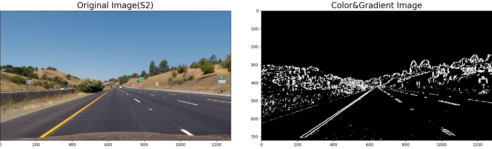
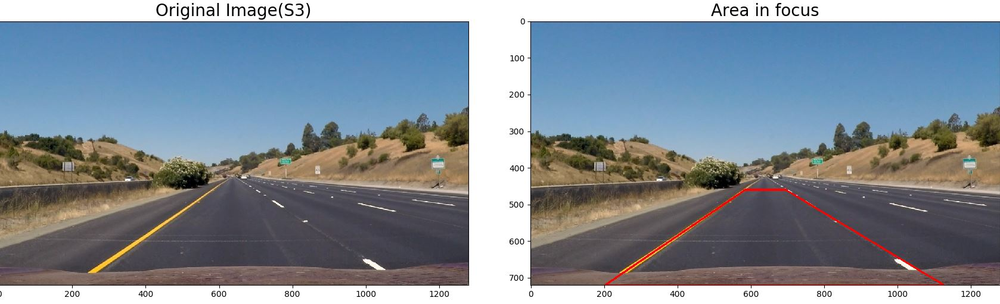
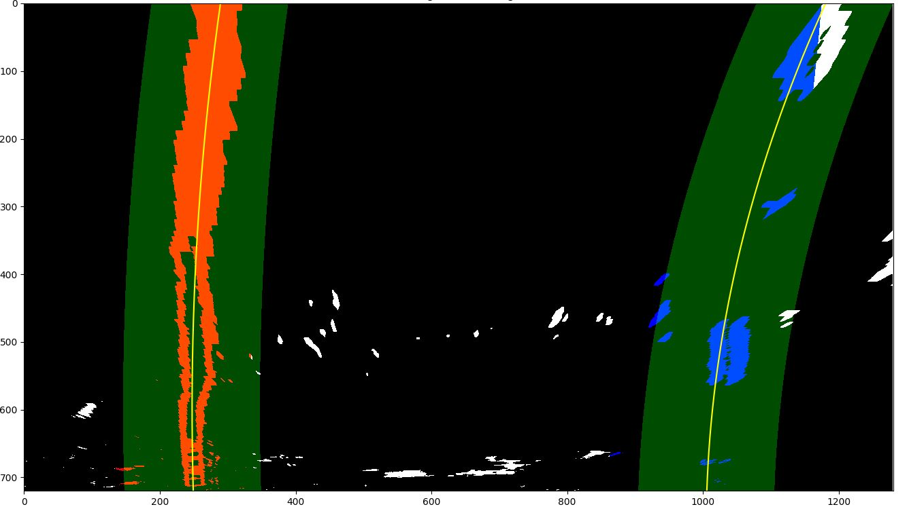

## Introduction
In Project 1 of this course we students designed a lane finder using Hough Transforms and Canny edge detection. The aim of this project was to do the same but also detect curvature of lane and offset of the vehicle from the center using more advanced computer vision techniques.

The pipeline for this project looks something like this:
 

*Figure 1*

## Camera Calibration
First stage of the pipeline was to calibrate the camera using chessboard images. OpenCV has in built functions which takes in chessboard images and searches for the specified number of corners(3d object points) in the images. If the corners were found successfully on the images then the camera is successfully calibrated and images can be undistorted using the camera matrix, which has the focal length and camera center information.

The image set provided by Udacity had (9,6) corners(standard chesboard is 7x7). For 3 of the images in the set I had to use a different set of corners to make sure the OpenCV API _findChessboardCorners()_ detected corners in those 
images as well. 

The API returns image points(2d) which represents the position of the corners in the images. Here is a sample image used in the camera calibration. 

*Figure 2*

> Code: cameracal.py, Function: cameraCalibration()

## Distortion Correction 
Once the camera has been calibrated the camera matrix can be used to undistort(radial and tangential) images. The camera matrix has the focal length and camera center information. A nice way to verify if the camera was calibrated accurately is to verify on a test image like the one shown below. 

*Figure 3*

The result shows that the undistortion works pretty well. Another check one can do is to apply it on one of the images from the test set.

*Figure 4*

Although it's not as obvious(when compared to Figure 2), there is distortion correction on the image.

> Code: cameracal.py, Function: undistortImage()

## Color & Gradient Threshold
In this stage the undistorted image goes through 2 layers of filtering:

1. **Color Thresholding**: The idea behind this step is to detect the lanes using the properties of an image. The undistorted image is in the RGB format. While RGB is a useful format and various thresholds can be applied(like ranges on R, G, B) to detect lanes, it's not a robust format. There are other formats like HLS and HSV which more closely represent how humans process visual information. I had the most success in applying thresholding to detect lanes using the 'S' channel of the HLS image. Even though other areas of the image get highlighted, the area in focus is the road and the lanes(yellow and white) on it gets highlighted really well. I used a threshold set(min, max) to make sure the filtering removed what would be noise for the pipeline.

2. **Gradient Thresholding**: Sobel operator can be used on x-axis and y-axis of an image(single channel image) to detect gradients in the vertical and horizontal directions respectively. Since lanes are vertical in the image, I only applied the Sobel operator only on the x-axis. I used the 'L' channel of the HLS image to apply the Sobel Operator. Used a threshold set(min, max) here as well to remove gradients which are not useful for the pipeline. 

Combining the output from the 2 layers of filtering(logical Or), the output is a binary output with only pixels in the output which pass the color and gradient thresholds. 

*Figure 5*

> Code: colandgrad.py, Function: colorAndGradientThreshold()

## Perspective transform
The aim of this project is to detect lanes on the road and draw lanes on the road. The pipeline should draw lanes accurately even if the road is curving. This is where perspective transform helps. The idea behind perspective transform in this project is to select an area in the image(the road) and get a bird's eye view to understand the curvature. 

OpenCV provides an API which applies a perspective transform on an image based on the source and destination points passed in. I used the same co-ordinates as the one Udacity provided in the example report.

| Source | Destination |
| --- | --- |
| 585, 460 | 200, 0 |
| 595, 460 | 960, 0 |
| 1127, 720 | 960, 720 |
| 203, 720 | 200, 720 |

These vertices works really well when we consider the area in focus(source vertices). I say really well because the bird's eye view shows that the line is almost parallel after transformation. Here is an example of how the perspective transform looks on one of the test set images. 
 

*Figure 6*

*Figure 7*

> Code: persptrans.py, Function: perspectiveTransform()

## Lane, RoC and Offset
The final stage of the pipeline is to understand the transformed image and detect the lines, the curvature and the offset of the car within the lane. I solved this problem by approaching it in 3 phases.

* **Sliding Window(Phase 1)**: Used the recommended detection method provided by Udacity. The core idea is to first take a histogram of the binary image along the columns to detect peaks(left and right lanes). Detecting the peaks will give the x-position of the left and right lanes. From those two points, a sliding window is placed around the line centers, to find and follow the lines up to the top of the frame. 

*Figure 8*

*Figure 9*

* **Search Window(Phase 2)**: As recommended by Udacity, it is not required that we need to do the search from scratch on a new frame. A margin/offset from the previous lane position can be used for search for the next frame. This reduces processing time drastically. I also used this phase only till a threshold is met(5), after which I used averaging and best fit(Phase 3) to predict lanes.

*Figure 10*

* **Mean Search Window(Phase 3)**: Once a threshold is met, I calculated the best fit of the last 'N' frames(set to 5) and used that for predicting the lane position in the next frame. If the prediction using the best fit is better than the prediction using the most recent fit then there is no change in the best fit FIFO. But if the most recent fit predicted the current frame's lane position more accurately than the best fit, the new fit is added to the best fit FIFO after the oldest entry(used for predicting the best fit) is kicked out. The a new best fit is calculated and that is used for predicting the lane position. This phase really helped smoothing out the lane drawings & radius of curvature/offset predictions.

> Code: slidwindow.py, Function: slidingWindow()

## Project video
Here is a sample of how my final output looks like after going through all the stages of the pipeline. 
At the top left corner is the Radius of Curvature(RoC) in 'km'. RoC is displayed as "Road is nearly straight" if the road is straight because the RoC of a straight road is infinite. Also displayed below the RoC is the car offset in 'cm' from the center of the lane. The green fill represents the prediction of the lane(by the pipeline) on the road. 

*Figure 11*

The final project video is under the name "project\_video_output.mp4". 

> Main Code: test.py
 
## Discussion
My pipeline worked really well for the main project video. I knew that this wouldn't be a all encompassing solution for various road conditions. After viewing both the challenge videos provided by Udacity, here is the list of potential issues and what needs to improve in my pipeline to make it more robust to different scenarios.

1. **Change in road terrain**: In the challenge\_video.mp4 we can see that the yellow lines and the white dashed lines are very close to what appears be newer road intersecting with older road. This causes a change in gradient from one color to another. When applying Sobel(like I do in my pipeline), the output will have an edge because of this change in gradient. This is problematic with my pipeline because there is no advanced filtering to make sure that the pipeline only recognises yellow and white lanes. In fact when I tried running my pipeline it didn't perform very well for this video. 

2. **Rapid change in curvature**: My sliding window model should work great for straight roads and roads which don't have sharp curves but it would fail in scenarios where the curvature of the road changes changes rapidly. The sliding window needs to be definitely modified(or may be a different model) to account for rapid changes in curvature.

3. **Best Fit**: The best fit methodoly can be improved with more advanced outlier rejection techniques and better algorithms for smoothing out the best fit. Right now I calculate the best fit of the last 5 frames but that number can be definitely tuned to make sure that predictions are more uniform to change. 
 
4. **RoC**: With the current model there is a lot of variation in the RoC. The roads are designed with a gradual change in RoC as the road curves in and out. My pipeline can be improved to prevent less variation in RoC(frame by frame). 

5. **Other issues**: I can definitely see my pipeline failing for various scenarios like unclear road markings, light interference on markings, objects interfering with markings(stones, rain, snow). These would be outliers in our day to day driving experience but we as humans can handle it. So a pipeline should be made robust enough to handle this as well. 

I wish I had the time(full time job, unfortunately) to make the pipeline work for the challenge videos and also on videos taken by me. This pipeline works for a single case but it can be improved drastically and made robust given enough time and effort to develop and test. 