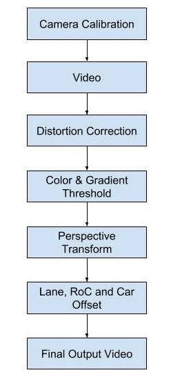
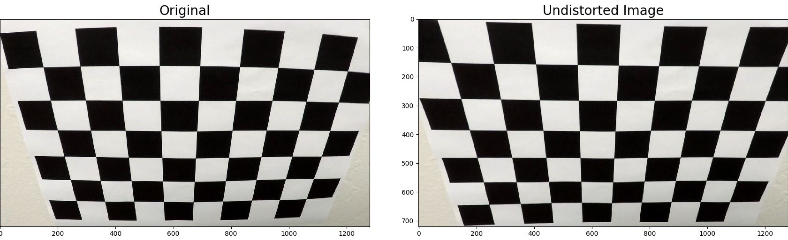
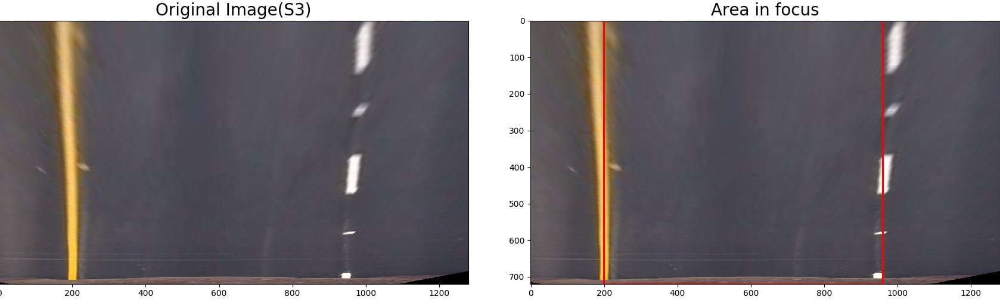

## Introduction
In Project 1 of this course we students designed a lane finder using Hough Transforms and Canny edge detection. The aim of this project was to do the same but also detect curvature of the line and the car offset from the center. This project involved more advanced computer vision techniques. Here is a snippet of the pipeline.

   

   <i>Figure 1</i>

## Camera Calibration
First stage of the pipeline was to calibrate the camera using chessboard images. OpenCV has in built functions which takes in chessboard images and searches for the specified number of corners(3d object points) in the images. If the corners were found successfully on the images then the camera is successfully calibrated and images can be undistorted using the camera matrix, which has the focal length and camera center information.

The image set provided by Udacity had 9,6 corners. For 3 of images in the set I had to use a different set of corners to make sure the OpenCV findChessboardCorners() function detected corners in those 
images as well. The API returns image points(2d) which represents the position of the points in the images.

> Code: cameracal.py, Function: cameraCalibration()

   

   <i>Figure 2</i>

## Distortion Correction 
Once the camera has been calibrated the camera matrix can be used to undistort(radial and tangential) images. A nice way to verify if the camera was calibrated accurately is to verify on a test image like the one shown below. 

> Code: cameracal.py, Function: undistortImage()

   

   <i>Figure 3</i>

The result shows that the undistortion works pretty well. Another check one can do is to apply it on one of the images from the test set.

   

   <i>Figure 4</i>

Although it's not as obvious(when compared to Figure 2), there is distortion correction on the image.

## Color & Gradient Threshold
In this stage the undistorted image goes through 2 layers of filtering:

1. **Color Thresholding**: The idea behind this step is to detect the lanes using the properties of an image. The undistorted image is in the RGB format. While RGB is a useful format and various thresholds can be applied(like ranges on R, G, B) to detect lanes, it's not a robust format. There are other formats like HLS and HSV which more closely represent how humans process visual information. I had the most success in applying thresholding to detect lanes using the 'S' channel of the HLS image. Even though other areas of the image get highlighted, the area in focus is the road and lanes gets highlighted really well. 

2. **Gradient Thresholding**: Sobel operator can be used on x-axis and y-axis of an image to detect gradients in the vertical and horizontal directions respectively. Since lanes are vertical in the image, I only applied the Sobel operator on the x-axis. I used the 'L' channel of the HLS image to apply the Sobel Operator. 

Combining the output from the 2 layers of filtering, the output is an binary output with only pixels which pass the color and gradient thresholds. 

> Code: colandgrad.py, Function: colorAndGradientThreshold()

   

   <i>Figure 5</i>

## Perspective transform
The aim of this project is to detect lanes on the road and draw lanes on the road. The pipeline should draw lanes accurately even if the road is curving. This is where perspective transform helps. The idea behind perspective transform in this project is to select an area in the image(the road) and get a bird's eye view to understand the curvature. 

OpenCV provides an API which applies a perspective transform on an image based on the source and destination points passed in. I used the same co-ordinates as the one Udacity provided in the example report.

| Source | Destination |
| --- | --- |
| 585, 460 | 200, 0 |
| 595, 460 | 960, 0 |
| 1127, 720 | 960, 720 |
| 203, 720 | 200, 720 |

These vertices works really well when we consider the area in focus(source vertices). I say really well because the bird's eye view shows that the line is almost parallel after transformation. 

> Code: persptrans.py, Function: perspectiveTransform()

   

   <i>Figure 6</i>

   

   <i>Figure 7</i>

## Lane, RoC and Offset
The final stage of the pipeline is to understand the transformed image and detect the lines, the curvature and the offset of the car within the lane. I solved this problem by approaching it in 3 phases.

> Code: slidwindow.py, Function: slidingWindow()

* **Sliding Window(Phase 1)**: Used the recommended detection method provided by Udacity. The core idea is to first take a histogram of the binary image along the columns to detect peaks(left and right lanes). Detecting the peaks will give the x-position of the left and right lanes. From those two points, a sliding window is placed around the line centers, to find and follow the lines up to the top of the frame. 

   

   <i>Figure 8</i>

   

   <i>Figure 9</i>

* **Search Window(Phase 2)**: As recommended by Udacity, it is not required that we need to do the search from scratch on a new frame. A margin/offset from the previous lane position can be used for search for the next frame. This reduces processing time drastically. I also used this phase only till a threshold is met(5), after which I used averaging and best fit(Phase 3) to predict lanes.

   

   <i>Figure 10</i>

* **Mean Search Window(Phase 3)**: Once a threshold is met, I calculated the best fit of the last 'N' frames(set to 5) and used that for predicting the lane position in the next frame. If the prediction using the best fit is better than the prediction using the most recent fit then there is no change in the best fit. But if the most recent fit predicted the current frame's lane position more accurately than the best fit, the new fit is added to the best fit FIFO after the oldest entry(used for predicting the best fit) is kicked out(aka FIFO). This phase really helped smoothing out the lane drawings, radius of curvature and offset.

## Project video
Here is a sample of how my final output looks like. 

   

   <i>Figure 11</i>

Link to final video: project_video_output.mp4

> Main Code: test.py
 
## Discussion
Problems discussion. 
